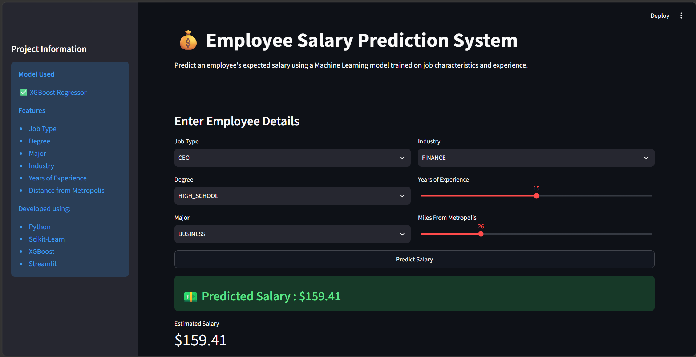
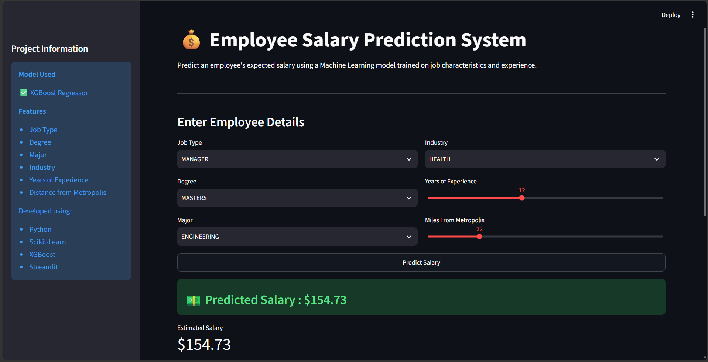

# 💼 Employee Salary Prediction using Machine Learning

<p align="center">
  
</p>

<p align="center">
  
  
  
  
  
</p>

---

# 📌 Project Overview

Employee Salary Prediction is an end-to-end Machine Learning project that predicts an employee's salary based on professional and educational attributes. The project covers the complete machine learning workflow, including data preprocessing, exploratory data analysis, feature engineering, model training, hyperparameter tuning, model evaluation, and deployment through an interactive Streamlit web application.

---

# 🎯 Problem Statement

Develop a regression model capable of predicting employee salaries using the following features:

- Job Type
- Degree
- Major
- Industry
- Years of Experience
- Distance from Metropolis

---

# 📂 Dataset

The dataset contains employee information such as:

- Job Type
- Degree
- Major
- Industry
- Years of Experience
- Distance from Metropolis
- Salary (Target Variable)

---

# 🛠️ Technologies Used

- Python
- Pandas
- NumPy
- Matplotlib
- Seaborn
- Scikit-learn
- XGBoost
- Joblib
- Streamlit

---

# 🔄 Project Workflow

## 📌 Data Preprocessing

- Loaded and explored the dataset
- Checked missing values
- Removed duplicate records
- Verified data consistency

## 📊 Exploratory Data Analysis (EDA)

- Salary distribution analysis
- Correlation analysis
- Feature relationship analysis
- Outlier detection

## ⚙️ Feature Engineering

- One-Hot Encoding
- Feature Scaling using MinMaxScaler
- Train-Test Split

## 🤖 Model Building

The following regression models were evaluated:

- Linear Regression
- Random Forest Regressor
- XGBoost Regressor

The best-performing model was selected based on evaluation metrics.

## 🎯 Hyperparameter Tuning

Optimized the model using hyperparameter tuning to improve prediction performance.

## 📈 Model Evaluation

Performance was evaluated using:

- R² Score
- Mean Absolute Error (MAE)
- Mean Squared Error (MSE)
- Root Mean Squared Error (RMSE)

## 🌐 Model Deployment

The trained model was saved using Joblib and deployed as an interactive Streamlit web application for real-time salary prediction.

---

# 🚀 Streamlit Web Application

The web application allows users to:

- Predict employee salary instantly
- Enter employee information using an intuitive interface
- Receive real-time salary predictions
- Experience a clean and interactive dashboard

---

# 📷 Project Screenshots

## 🏠 Home Page

<p align="center">
  
</p>

---

## 💰 Prediction Example

<p align="center">
  
</p>

---

# 📁 Project Structure

```text
Employee-Salary-Prediction-ML/
│
├── app.py
├── requirements.txt
├── salary_prediction_model.pkl
├── minmax_scaler.pkl
├── README.md
│
├── notebook/
│   └── Employee_Salary_Prediction.ipynb
│
├── dataset/
│   ├── train_features.csv
│   ├── train_salaries.csv
│   └── test_features.csv
│
└── Images/
    ├── prediction_example_1.png
    └── prediction_example_2.png
```

---

# ⚙️ Installation

### Clone the repository

```bash
git clone https://github.com/mayurmali-01/Employee-Salary-Prediction-ML.git
```

### Navigate to the project folder

```bash
cd Employee-Salary-Prediction-ML
```

### Install the required packages

```bash
pip install -r requirements.txt
```

### Run the Streamlit application

```bash
streamlit run app.py
```

---

# 📌 Future Improvements

- Batch prediction using CSV upload
- Explain predictions using SHAP
- Docker deployment
- Cloud deployment using AWS or Azure
- REST API integration

---

# 👨‍💻 Author

## Mayur Sandip Mali

**Artificial Intelligence & Data Science Engineer**

- **GitHub:** https://github.com/mayurmali-01
- **LinkedIn:** https://www.linkedin.com/in/mayurmali01/

---

## ⭐ If you found this project useful, consider giving it a Star!
